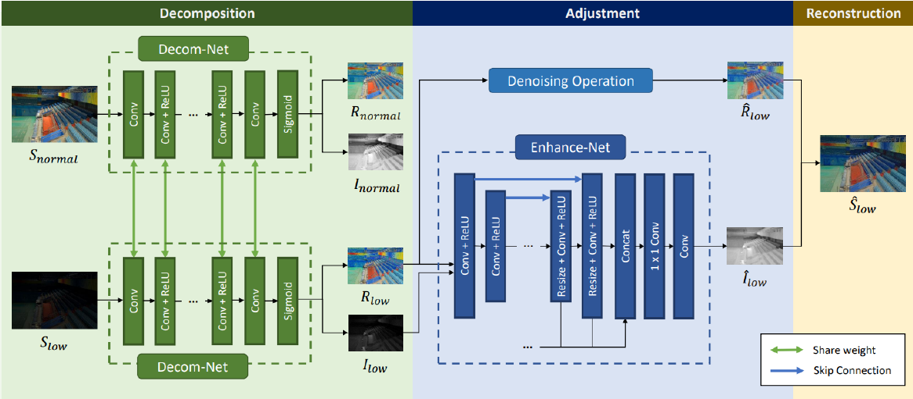
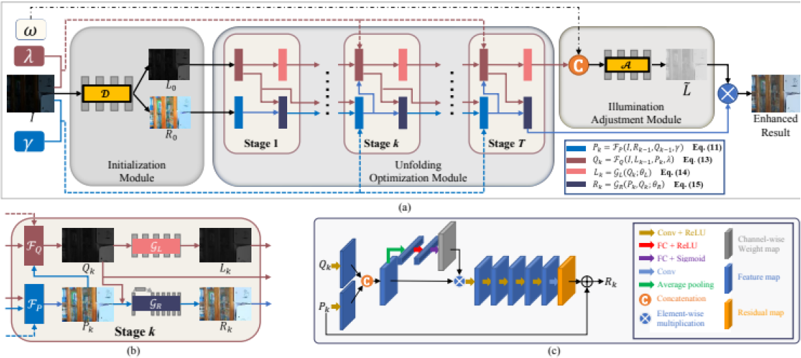
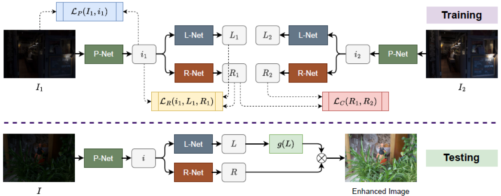
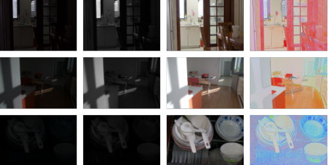
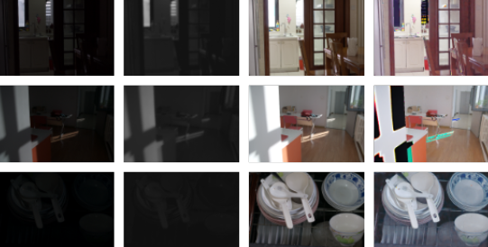
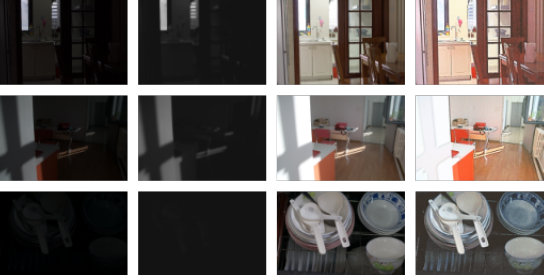
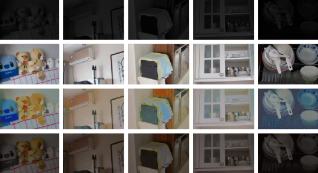

# **Retinex-Guided Diffusion-Based Low-Light Image Enhancement**

## **Overview**
This repository focuses on **low-light image enhancement (LLIE)** using **Retinex theory** and advanced methods like **diffusion models**. The project includes a comprehensive survey of LLIE algorithms and implementation of the **Retinex-Net** model with perceptual loss to improve image quality under low-light conditions.

---

## **Motivation**
This project marks an important step in exploring **image enhancement techniques** for low-light scenarios. It aims to:
- Address challenges in photography and imaging systems under poor lighting.
- Study and apply **Retinex theory** for image decomposition into illumination and reflectance components.
- Integrate **diffusion models** to further enhance illumination for better results.

---

## **Methodology**

### **1️⃣ Literature Survey**
A comprehensive study was conducted on various LLIE methods, focusing on Retinex-based approaches:

### **1️⃣ Literature Survey**

A comprehensive study was conducted on various **Low-Light Image Enhancement (LLIE)** methods, focusing on **Retinex-based approaches**. Here's a breakdown of the methods discussed:

#### **Retinex-Net**
- **Dataset**: Uses the **LOL (Low-Light Dataset)**, consisting of paired low-light and normal-light images.
- **Components**:
  - **Decom-Net**: Decomposes images into **illumination** and **reflectance** components.
  - **Enhance-Net**: Enhances the **illumination map**.
- **Training**: No ground truth is provided for illumination or reflectance. Instead, the network learns by comparing **low-normal paired images**.
- **Goal**: Reconstructs the enhanced image by combining the **enhanced illumination** with the **reflectance map**.
- **Outcome**: Provides high-quality image enhancement from low-light conditions.

---

#### **URetinex-Net**
- **Approach**: Proposes a **Retinex-based deep unfolding network** for low-light image enhancement.
- **Key Modules**:
  1. **Illumination Adjustment Module**: Allows **user-specified adjustments** to the illumination layer.
  2. **Unfolding Optimization Module**: Uses deep networks to decompose images into **reflectance** and **illumination** components.
  3. **Initialization Module**: Sets the initial conditions for decomposition.
- **Goal**: To enhance the **illumination** of low-light images by decomposing them into illumination and reflectance and then adjusting the illumination.
- **Outcome**: Achieves high-quality low-light image enhancement using deep networks.

---

#### **PairLIE**
- **Method**: An **unsupervised technique** using **pairs of low-light images** to learn **adaptive priors**.
- **Components**:
  1. **L-Net**: Estimates the **illumination map**.
  2. **R-Net**: Extracts the **reflectance map**.
  3. **P-Net**: Removes unwanted features from the original low-light image.
- **Training Phase**: **P-Net** optimizes the low-light image pairs, while **L-Net** and **R-Net** estimate the latent **illumination** and **reflectance**.
- **Testing Phase**: The **illumination correction factor** is applied to **P-Net**, **R-Net**, and **L-Net** for final enhancement.
- **Outcome**: Provides enhanced images with improved illumination and reduced noise using unsupervised learning.

### **2️⃣ Dataset**

This project uses two key datasets to train and evaluate the models: **LOL Dataset** and **Cube++ Dataset**. Both datasets contain pairs of low-light and normal-light images to facilitate low-light image enhancement tasks.

#### **LOL (Low-Light) Dataset**
- **Description**: The LOL dataset consists of **500 pairs of low-light and normal-light images**. These pairs are designed to simulate real-world low-light scenarios and provide a reference for model training and evaluation.
- **Image Pairing**: Each low-light image is paired with a corresponding well-exposed normal-light image. The goal is to enhance the low-light images to match the quality of the normal-light images.
- **Purpose**: The dataset is primarily used for training **Retinex-Net**, **URetinex-Net**, and similar models focused on low-light image enhancement. It also serves as a benchmark for evaluating the effectiveness of enhancement methods.
- **Access**: The LOL dataset is publicly available for research purposes and can be found [here](https://github.com/dongxu-liu/LOL).
  
#### **Cube++ Dataset**
- **Description**: The Cube++ dataset is a larger collection that includes **4,890 high-resolution images** captured under varying light conditions, including both low-light and normal-light scenarios.
- **Image Variety**: The Cube++ dataset provides more diverse lighting conditions, offering both indoor and outdoor scenes with a range of illuminations. This variation is important for training models that can generalize well to different real-world low-light conditions.
- **Resolution**: The images in the Cube++ dataset are high-resolution, which ensures that the models can learn detailed features for more accurate image enhancement.
- **Purpose**: This dataset is used for training models, such as **PairLIE**, and also for evaluation on a more diverse set of images compared to the LOL dataset. The larger size of Cube++ allows for better generalization during model training.
- **Access**: The Cube++ dataset is publicly available and can be found [here](https://github.com/IntelLabs/Cube++).

---

### **Dataset Usage in the Project**
- **Training and Testing**: Both LOL and Cube++ datasets are used for training and testing various low-light image enhancement models like **Retinex-Net**, **URetinex-Net**, and **PairLIE**. The **low-light images** from both datasets serve as the input, and the **normal-light images** serve as the ground truth for comparison.
  
- **Preprocessing**: Images from both datasets are preprocessed to resize them to a consistent size, and normalization is applied to make the training process more stable. Additionally, data augmentation techniques like random cropping and flipping are applied to increase the diversity of the training set.

### **3️⃣ Approach**

In this project, we have primarily focused on the **decomposition of images** into their key components—**illumination** and **reflectance**—as a core approach to low-light image enhancement. Here's an overview of how we applied this methodology:

1. **Retinex Theory**:  
   The core of our approach is based on **Retinex Theory**, which proposes that an image can be decomposed into two key components:
   - **Illumination**: This represents the lighting or global light information in the scene.
   - **Reflectance**: This is the inherent color and texture of the objects in the scene, independent of lighting conditions.

   By isolating these two components, Retinex Theory enables more effective enhancement of low-light images. The illumination map can be enhanced independently, leading to better visibility without distorting the reflectance map. The final enhanced image is created by recombining these enhanced components.

2. **Retinex-Net**:  
   Building on **Retinex Theory**, we implemented the **Retinex-Net** model, which aims to improve the illumination of low-light images. The model includes two main components:
   - **Decom-Net**: This network decomposes the input image into its **illumination** and **reflectance** components. It helps separate the challenging low-light illumination from the stable reflectance.
   - **Enhance-Net**: This component focuses on enhancing the **illumination map** to bring more light to the low-light regions of the image, making it closer to the reference normal-light image.

   The goal is to learn how to separate and enhance the illumination while keeping the reflectance map intact. We focus on this decomposition process to address the core challenge in low-light image enhancement.

3. **Diffusion Models**:  
   While the focus of our work has been on image decomposition, we also explored **diffusion models** as a complementary technique. Diffusion models leverage the **varying illumination information** from both the low-light and normal-light images to learn an effective enhancement strategy. These models can provide an additional layer of improvement by guiding the enhancement process and refining the decomposition-based outputs.

---
### **VGG16 Network-Based Perceptual Loss Function**

In this project, we utilize a **VGG16-based perceptual loss function** inside a deep learning framework for low-light image enhancement. The perceptual loss function is designed to compare high-level features of the enhanced image with the target image, leading to improved visual quality. Here's a breakdown of how the perceptual loss is integrated into the model:

#### **1️⃣ Setting Up the VGG16 Network for Feature Extraction**
- The first step in creating the perceptual loss function is to set up a **pre-trained VGG16 network**. The network is used for feature extraction rather than classification, as we are interested in the deep features of the images.
- VGG16 is known for capturing rich, hierarchical features at various levels (low-level textures, high-level semantic structures) of an image, which are important for perceptual quality.

#### **2️⃣ Inputs: Illumination and Reflectance**
- The inputs to the network are the **Illumination map** and the **Reflectance map**, which are decomposed from the low-light image based on **Retinex Theory**.
- These two components serve as the inputs for feature extraction. The illumination map is the region that needs enhancement, and the reflectance map is the stable component that should remain unaffected.

#### **3️⃣ Feature Computation**
- The **VGG16 network** computes intermediate features from both the illumination and reflectance maps. These features capture important high-level details about the input image that can be used to assess the perceptual quality of the enhanced image.
  
#### **4️⃣ Loss Computation**
- After extracting features using the VGG16 network, several kinds of **losses** are computed. These include:
  - **Reconstruction Loss**: Measures the difference between the predicted and target image features. This is calculated using **L2 loss** on the features at various layers.
  - **Perceptual Loss**: The main goal of the perceptual loss is to align the high-level features between the enhanced image and the normal-light reference image, ensuring that the perceptual quality is improved.
  - **Total Loss**: The total loss function combines multiple loss terms, including perceptual, reconstruction, and regularization losses, to optimize the model during training.

#### **5️⃣ Training**
- These losses are backpropagated to optimize the **illumination enhancement** and **reflectance preservation**. The **perceptual loss** ensures that the enhanced image looks visually similar to the target image, improving subjective image quality.
### **Focus on Decomposition**
While we have explored advanced techniques like diffusion models, the primary focus of this project is the **decomposition of images into illumination and reflectance components**. This approach allows for better manipulation of the low-light images, enhancing the lighting conditions without losing the important details from the original image. The result is a more balanced and natural-looking enhanced image, with improved visibility in low-light environments.

---

## **Results**

### **Key Achievements**
- Implementation of **Retinex-Net** for illumination enhancement.
- Integration of perceptual loss for improving visual quality.
- Comparative analysis of **PSNR** and **SSIM** values with state-of-the-art methods.
### **Performance Evaluation Metrics**

To evaluate the performance of the proposed **low-light image enhancement** architecture, we use two popular metrics to assess image quality: **Peak Signal-to-Noise Ratio (PSNR)** and **Structural Similarity Index Measure (SSIM)**. These metrics help quantify how well the enhanced image matches the ground truth in terms of both visual quality and structural preservation.

#### **1️⃣ Peak Signal-to-Noise Ratio (PSNR)**
PSNR is a widely used metric that compares the similarity between an original image and a processed image. It is defined as the ratio between the **maximum possible signal strength** and the amount of **corrupting noise** in the image. Higher PSNR values indicate better image quality.

The formula for PSNR is:

\[
PSNR = 10 \cdot \log_{10}\left(\frac{MAX^2}{MSE}\right)
\]

Where:
- **MAX** is the maximum possible pixel value of the image.
- **MSE (Mean Squared Error)** is the average of the squared pixel errors between the original and reconstructed images.

The **MSE** can be computed as:

\[
MSE = \frac{1}{N \cdot M} \sum_{i=1}^{N} \sum_{j=1}^{M} \left[ I(i,j) - K(i,j) \right]^2
\]

Where:
- **I(i,j)** and **K(i,j)** represent the pixel values of the original image and the processed image respectively.
- **N** and **M** are the dimensions of the image.

#### **2️⃣ Structural Similarity Index Measure (SSIM)**
The SSIM is a comprehensive metric that evaluates the perceived quality of an image. Unlike PSNR, which focuses solely on pixel-wise error, SSIM takes into account the **structural information** in the image, such as luminance, contrast, and texture. SSIM is considered a better metric for assessing perceived image quality.

The SSIM formula is as follows:

\[
SSIM(x, y) = \frac{(2\mu_x \mu_y + C_1)(2\sigma_{xy} + C_2)}{(\mu_x^2 + \mu_y^2 + C_1)(\sigma_x^2 + \sigma_y^2 + C_2)}
\]

Where:
- **x** and **y** are the input images being compared.
- **μx**, **μy** are the means of the images **x** and **y**.
- **σx**, **σy** are the standard deviations of **x** and **y**.
- **σxy** is the covariance of **x** and **y**.
- **C1** and **C2** are constants to avoid instability when the denominator approaches zero.

SSIM produces a value between **-1 and 1**, where a higher value indicates better similarity to the reference image.

---

### **Sample Results**
- Enhanced images demonstrate reduced noise and improved contrast under low-light conditions.
- Qualitative and quantitative results show significant improvement over baseline methods.

---
## **Experimental Results**

### **4.3.1 Retinex-Net**

Figure 4.3: The first column of images represents the **input image**, the second column represents the **illumination map**, the third column represents the **ground truth**, and the fourth column represents the **reflectance map**.

---

### **4.3.2 URetinex-Net**

Figure 4.4: The first column of images represents the **input image**, the second column represents the **illumination map**, the third column represents the **ground truth**, and the fourth column represents the **reflectance map**.

---

### **4.3.3 PairLIE**

Figure 4.5: The first column of images represents the **input image**, the second column represents the **illumination map**, the third column represents the **ground truth**, and the fourth column represents the **reflectance map**.

### **4.3.4 Qualitative Comparison**

Figure 4.6: The first row represents the **input images**, the second row represents the **ground truth**, the third row represents the **enhanced images from Retinex-Net with L1 loss**, and the last row represents the **enhanced images from Retinex-Net with Perceptual loss**.

---

## **Chapter 5: Conclusions and Future Scope**

### **5.1 Conclusion**

In this work, we have successfully constructed and compared three different **Retinex-based algorithms** for decomposing images into their illumination and reflectance components. The chosen algorithms were put through a thorough testing process, in which loss functions were changed to assess how well they improved low-light photographs. 

Our results lay the groundwork for our overarching objective of improving low-light photos by using **Retinex-guided diffusion processes**. This phase creates a solid foundation for the diffusion strategies that will be implemented later, guaranteeing a methodical and well-informed approach for future work.

---

## **Learnings**
- Gained expertise in **Retinex theory** and its application in LLIE.
- Explored advanced methods like **URetinex-Net** and **diffusion models**.
- Understood **image decomposition techniques** and **evaluation metrics** like PSNR and SSIM.

---

## **Team**
- **G.Gyaneshwar Rao**  
  *Email*: [ggyaneshwarrao1@gmail.com](mailto:ggyaneshwarrao1@gmail.com)
- **Tarun Divatagi**  
- **Rahul Hegde**  

---

## **References**
1. **Deep Retinex Decomposition for Low-Light Enhancement**: [View Paper](https://arxiv.org/abs/1808.04560)
2. **URetinex-Net: Retinex-based Deep Unfolding Network for Low-light Image Enhancement**: [View Paper](https://arxiv.org/abs/2206.03080)
3. **Diff-Retinex: Rethinking Low-Light Image Enhancement with Generative Diffusion Models**: [View Paper](https://arxiv.org/abs/2303.06705)

---
